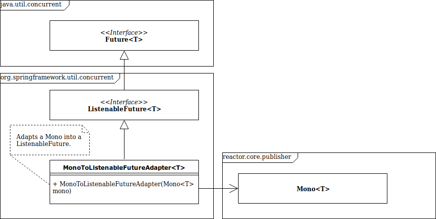

# Adapter pattern example

example of the adapter pattern in the Spring framework :

MonoToListenableFutureAdapter

MonoToListenableFutureAdapter<T> est en fait composé d'un MonoProcessor<T>, qui est un Mono<T>

